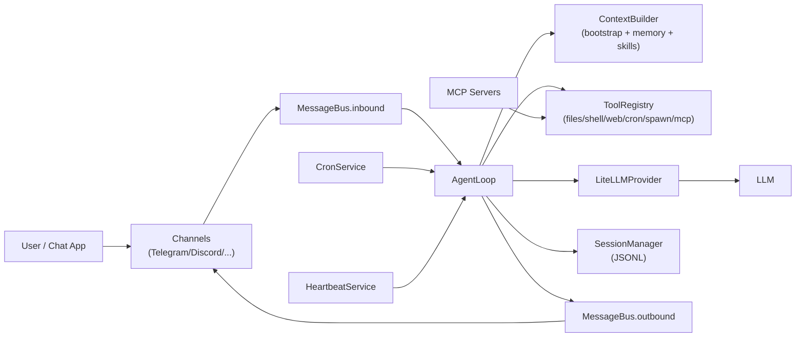
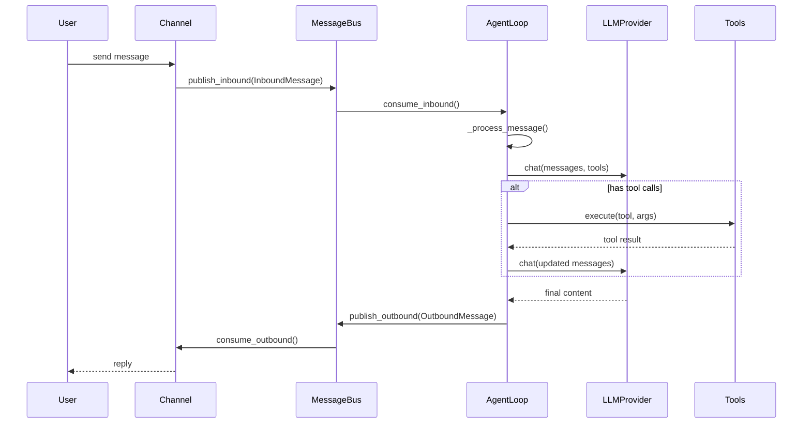

# OpenClaw 架构拆解之旅（基于 nanobot 实现）

> 说明：当前仓库并不是 OpenClaw 源码本体，而是一个受 OpenClaw 启发的精简实现。本文用 nanobot 的真实代码，映射出 OpenClaw 风格架构的核心骨架。

## 1. 一眼看全局

## 2. 启动拓扑（Gateway 模式）

`nanobot gateway` 启动后会拉起以下四个长期任务：

1. `AgentLoop.run()`：核心推理与工具执行循环  
2. `ChannelManager.start_all()`：各聊天通道监听与发送  
3. `CronService.start()`：定时任务调度  
4. `HeartbeatService.start()`：周期唤醒检查任务

对应代码入口：
- `nanobot/cli/commands.py`

## 3. 主链路（从用户消息到回复）

关键代码：
- `nanobot/channels/base.py`
- `nanobot/bus/queue.py`
- `nanobot/agent/loop.py`
- `nanobot/providers/litellm_provider.py`

## 4. 架构层拆解

### 4.1 接入层（Channels）

- 所有平台都实现 `BaseChannel`：`start/stop/send`
- 入站统一封装成 `InboundMessage`
- 出站统一消费 `OutboundMessage`
- 访问控制由 `allow_from` 执行

关键代码：
- `nanobot/channels/base.py`
- `nanobot/channels/manager.py`

### 4.2 传输层（MessageBus）

- `inbound` 队列：通道 -> Agent
- `outbound` 队列：Agent -> 通道
- 彻底解耦“平台适配”和“推理内核”

关键代码：
- `nanobot/bus/queue.py`
- `nanobot/bus/events.py`

### 4.3 决策层（AgentLoop）

- 读取会话历史（`SessionManager`）
- 组装上下文（`ContextBuilder`）
- 调 LLM 获取 tool call 或最终回答
- 执行工具并回灌结果，直到收敛或达到迭代上限
- 将消息持久化并发送回复

关键代码：
- `nanobot/agent/loop.py`
- `nanobot/session/manager.py`

### 4.4 上下文层（Context/Memory/Skills）

- Bootstrap 文件：`AGENTS.md`、`SOUL.md`、`USER.md`、`TOOLS.md`
- 长期记忆：`memory/MEMORY.md`
- 历史日志：`memory/HISTORY.md`
- Skills：支持“摘要注入 + 按需 read_file 深读”的渐进加载

关键代码：
- `nanobot/agent/context.py`
- `nanobot/agent/memory.py`
- `nanobot/agent/skills.py`

### 4.5 能力层（Tools）

默认工具集：
- 文件工具：`read_file/write_file/edit_file/list_dir`
- 命令工具：`exec`
- Web 工具：`web_search/online_search/web_fetch`
- 会话工具：`message`
- 并行任务：`spawn`（子代理）
- 调度工具：`cron`
- 扩展工具：`mcp_*`（运行时注册）

关键代码：
- `nanobot/agent/tools/registry.py`
- `nanobot/agent/tools/filesystem.py`
- `nanobot/agent/tools/shell.py`
- `nanobot/agent/tools/web.py`
- `nanobot/agent/tools/spawn.py`
- `nanobot/agent/tools/cron.py`
- `nanobot/agent/tools/mcp.py`

### 4.6 模型层（Provider）

- 对上：统一 `LLMProvider.chat()` 接口
- 对下：`LiteLLMProvider` + Provider Registry 做路由/前缀/参数覆写
- 支持 gateway/provider/local 三类路径（如 OpenRouter、标准云厂商、vLLM）

关键代码：
- `nanobot/providers/base.py`
- `nanobot/providers/litellm_provider.py`
- `nanobot/providers/registry.py`

### 4.7 控制面（Cron + Heartbeat + Subagent + MCP）

- `CronService`：维护任务存储、下次触发时间、执行回调
- `HeartbeatService`：周期触发代理读取 `HEARTBEAT.md`
- `SubagentManager`：后台并行任务，完成后以 system message 回注主会话
- MCP：连接外部 server 并包装成原生 Tool 注入 registry

关键代码：
- `nanobot/cron/service.py`
- `nanobot/heartbeat/service.py`
- `nanobot/agent/subagent.py`
- `nanobot/agent/tools/mcp.py`

## 5. OpenClaw 风格映射总结

如果把 OpenClaw 风格抽成方法论，这套实现对应为：

1. **统一消息总线**：多渠道接入，不侵入核心推理  
2. **工具优先的 agent runtime**：LLM 负责决策，工具负责执行  
3. **会话与记忆双层持久化**：短期会话 + 长期 memory/history  
4. **控制面独立**：cron/heartbeat/subagent 与主回路并行演进  
5. **协议化扩展**：MCP 让外部能力低耦合接入

## 6. 下一站建议（拆解路线）

建议按下面顺序继续深入：

1. Agent ReAct 细节：`AgentLoop._run_agent_loop` 的迭代收敛策略  
2. 工具安全边界：`filesystem/shell/web` 的输入校验与护栏  
3. 会话与记忆压缩：`_consolidate_memory` 的触发与失败回退  
4. 通道插件化模式：任选一个 channel（建议 Telegram）走完整入站链路  
5. MCP 生命周期：连接、注册、调用、清理的故障语义
